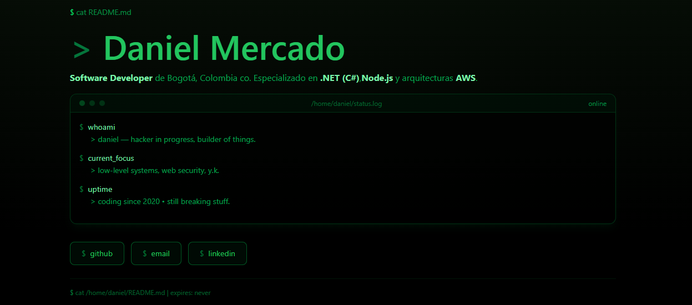

---

Software Developer de Bogotá, Colombia 🇨🇴.  
Especializado en **.NET (C#)**, **Node.js** y arquitecturas **AWS**.
📍 Cursando Ingeniería Informática  
🔭 Trabajando en **Reqly**, **PomodoroFocus** y este portfolio  
🌱 Aprendiendo seguridad ofensiva y sistemas de bajo nivel

### 📬 Contacto

- GitHub: [@damet24](https://github.com/damet24)
- LinkedIn: [Damet24](https://linkedin.com/in/Damet24)
- Email: daniel.mercado.dev@gmail.com
